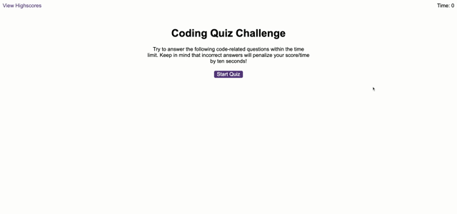

# Coding-Quiz-Challenge

---

### \_As a coding bootcamp student, I wanted to create a timed quiz on JavaScript fundamentals. This quiz will stores high scoresa using local storage giving the user an opportunity to challenge freinds.

Currently depolyed at [GitHub Pages](https://mrjacoughlin.github.io/Coding-Quiz-Challenge/.)

---

## Features

- Timed Quiz with questions and mulitple choice answers,
- When the user clicks "Start Quiz" The time will begin the count down.
- When user clicks on the answer it will diplay either correct/false.
- If the user clicks on a false answer time will be decuted.
- Once the user completes all question they have the option to enter their intials,
- This will then be stored on Local Storage.
